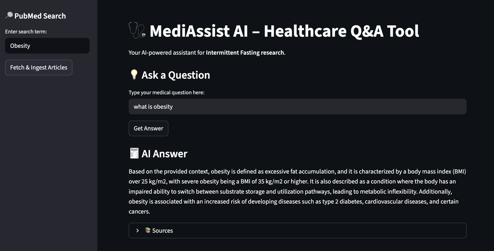

# 🩺 MediAssist AI – Healthcare Q&A Tool  

A deep learning-powered healthcare application that **provides evidence-based answers on intermittent fasting (IF) for obesity, Type 2 Diabetes, and metabolic disorders**.  
Built with **RAG (Retrieval-Augmented Generation)**, **ChromaDB**, **LLaMA (Groq API)**, and **Streamlit**.  
Live Demo – *[Insert your Streamlit app link here]*  

---

## 🚀 Features  

- **🔎 PubMed Document Retrieval** – Search and fetch relevant research articles on intermittent fasting with automated parsing of abstracts, authors, journals, and publication dates.  
- **🗄️ Vector Store with ChromaDB** – Ingests PubMed abstracts into a persistent semantic database for efficient retrieval.  
- **🧠 RAG-Powered Q&A** – Uses LLaMA-based model to generate concise, context-aware answers from retrieved medical literature.  
- **🌐 Streamlit Web App** – Interactive interface with sidebar for document search and main query bar for natural language questions.  
- **⚡ Clinician-Focused Insights** – Simplifies decision-making by providing clear guidance with references to source articles.  

---

## 🖼️ Screenshot  

  

---

## 🛠️ Installation  

```bash
# Clone this repository
git clone https://github.com/your-username/mediassist_ai.git
cd mediassist_ai

# Create and activate a virtual environment (recommended)
python -m venv venv
source venv/bin/activate   # On macOS/Linux
venv\Scripts\activate      # On Windows

# Install dependencies
pip install -r requirements.txt
```

```bash
# Run Streamlit app
streamlit run streamlit_app.py
